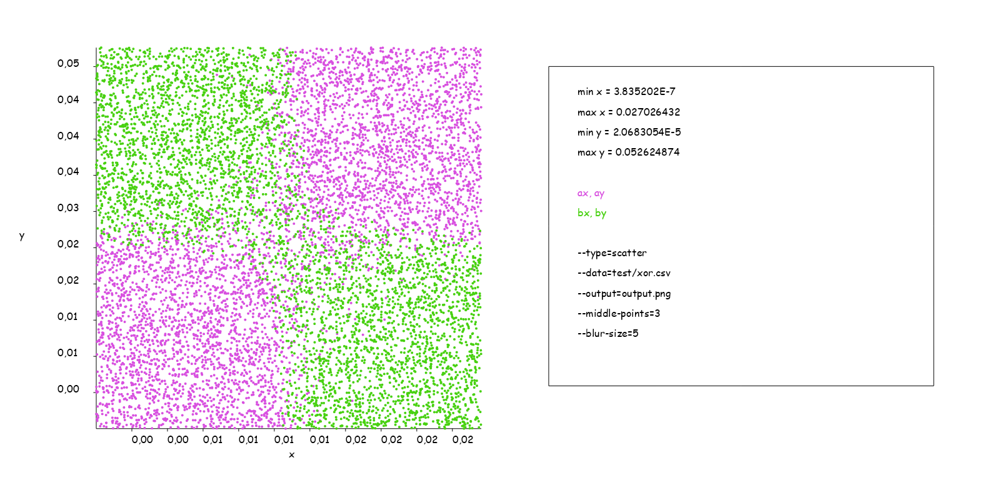

# Basics of programming course: data vizualization tool

## Running the plotter
Just run it with any arguments and you will see help text with all available options and their values. 

## Overview of different plot types

### Scatter
It's not very complicated type, so all of its capabilities are demonstrated by one example:

### Line
Here go the parameters. Let's take data from a school physical experiment and try to plot it:

Though it's very accurate, it will be good to make it smoother:

Seems like it's not what we wanted, because some information was lost.
To counter this effect let's add more points to each segment before smoothing.

Finally, a graphic that can do it both.

Same as in scatter, line plot can contain many data series at once (one column for x and many for ys) 

### [KDE](https://en.wikipedia.org/wiki/Kernel_density_estimation)
It has two subtypes, one finds something like sum of values per unity area, while other finds average value (and equals to first divided by density of data at that point).
To understand the difference better let's look at them on two dataseries:
#### Sum

#### Average

## And a few other funny plots 

